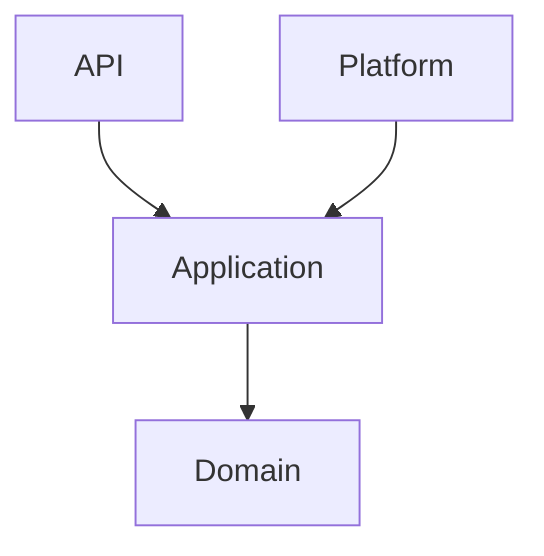
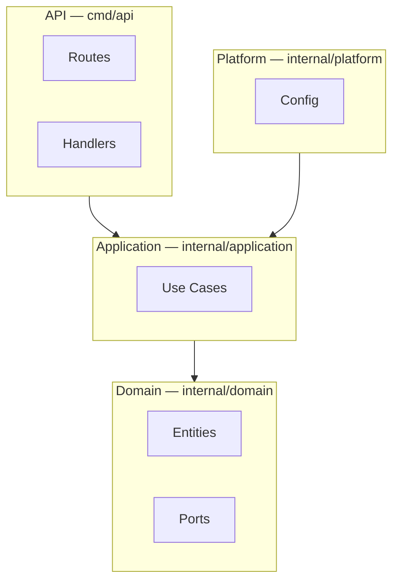
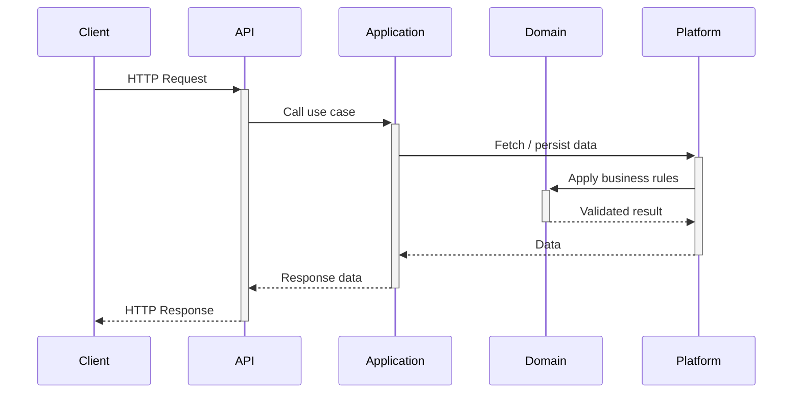

# Financial Manager API

Backend service in Go for tracking personal finances, including income, expenses, and source categorization.

## Requirements

- Go 1.25+
- Docker + Docker Compose (only for development with hot reload)
- `golangci-lint` (optional, for linting)

## Configuration

Environment variables with their defaults:

| Variable | Default       | Description             |
| -------- | ------------- | ----------------------- |
| `PORT`   | `8080`        | HTTP server port        |
| `ENV`    | `development` | Application environment |

## Running the API

### Local

```bash
make run
```

### Docker — Development (Hot Reload)

```bash
make docker-run
```

Uses `Dockerfile.dev` + [Air](https://github.com/air-verse/air). Changes to `.go` files trigger an automatic rebuild inside the container.

## Available Commands

| Command             | Description                                   |
| ------------------- | --------------------------------------------- |
| `make run`          | Run the API server                            |
| `make build`        | Build the binary to `bin/api`                 |
| `make test`         | Run tests with race detector and coverage     |
| `make lint`         | Run golangci-lint                             |
| `make tidy`         | Run go mod tidy                               |
| `make docker-build` | Build Docker Compose services                 |
| `make docker-run`   | Start Docker Compose services (detached mode) |
| `make docker-down`  | Stop and remove Docker Compose services       |

## API Endpoints

| Method | Endpoint  | Description  |
| ------ | --------- | ------------ |
| `GET`  | `/health` | Health check |

**Example:**

```bash
curl http://localhost:8080/health
```

```json
{
  "status": "healthy"
}
```

## Architecture

### Layer Dependencies

Defines what each layer is allowed to know about.



### Component Overview

Shows what lives inside each layer.



### Request Lifecycle

How an HTTP request flows through the system.



## Project Structure

```
.
├── cmd/
│   └── api/
│       ├── main.go          # Entry point
│       ├── routes.go        # Route registration
│       ├── dependencies.go  # Dependency wiring
│       └── handlers/        # HTTP handlers
├── internal/
│   ├── domain/              # Entities, ports, business rules
│   ├── application/         # Use cases and orchestration
│   └── platform/            # Config and infrastructure adapters
├── docker-compose.yml
├── Dockerfile.dev
└── Makefile
```

## License

[MIT](LICENSE)
